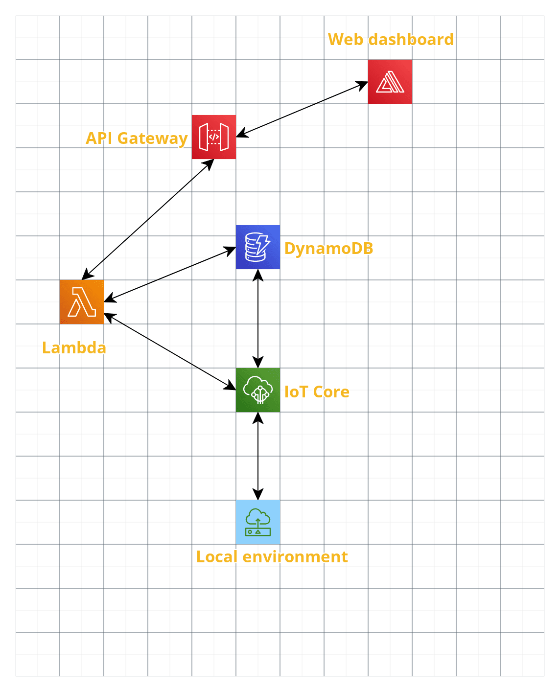
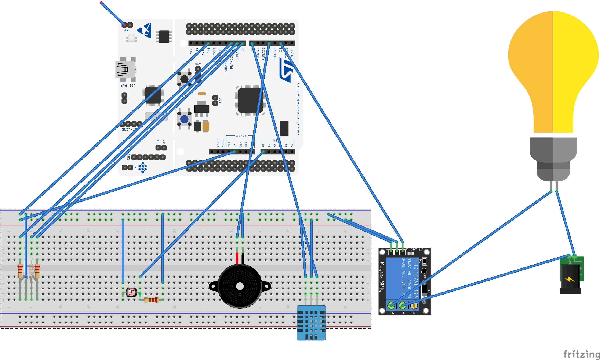
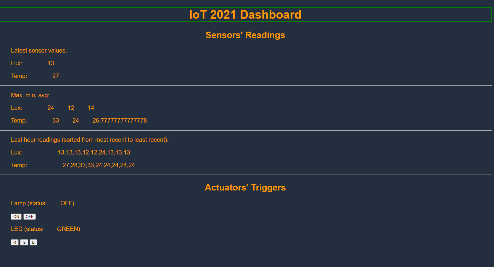

# IoT-2021-Individual-Assigments
Individual assignments for the IoT 2021 Course @ Sapienza University of Rome

Web dashboard: https://dev867.dyaycgfnuds5z.amplifyapp.com/

## 1. Questions
### 1.1. What is the problem and why do you need IoT?
The aim of the application developed for this individual assignment is to optimize the power consumption in working places. This is achieved by sensing the environment to detect potential power wastesfulness, in terms of artificial lights and heating/cooling system, in the rooms inside a building.  

In order to achieve this, the two following sensors are employed: 
- a **photocell**.
- a **DHT11** humidity & temperature sensor. 

The former is supposed to be connected to the room's light system **through a relay**, and *turn the lights  off* in the following cases:
- The lights are on and the *ambient light intensity* in the room *exceeds* a given *threshold*.
- The lights are on *outside the activity hours*. 

The latter is tasked with sensing the room's temperature and act by the means of a **RGB led** and an **active buzzer** under the following circumstances:
- If the current season is *Summer* (therefore the a/c is supposed to be turned on) and the room's temperature falls below the given *lower threshold* (i.e. the a/c is pumping too much cool air), the **led** becomes **blue** and the **buzzer** is triggered to notify the status change.
- If the current season is *Winter* (therefore the heating system is supposed to be turned on) and the room's temperature exceeds a given *upper threshold* (i.e. the system is pumping too much heat), the **led** becomes **red** and the **buzzer** is triggered to notify the status change.
- In normal situations, the **led** becomes **green** and the **buzzer** is not triggered (as no negative status change happened).

Both sensors gather data **periodically** and send them to the **IoT Core**, which analyzes them, performs the aforementioned checks and then takes a decison in terms of which actuators to trigger and how.   
Therefore, the *sensing* activity is **periodic**, but the *actuator's activation* is **event-driven**.

### 1.2. What data are collected and by which sensors?
The **ambient light intensity** and the **ambient temperature** are measured in parallel (i.e. on two separate threads) at the same time every **30 minutes** to detect variations. 
- The **photocell**  is a light-controlled variable resistor (i.e. an analog sensor). When the photocell is struck by light it drastically decreases its resistance until it reaches 500Ohm. In the absence of ambient light, the resistance of the photocell will become so high as 50KOhm which practically is non-conductive. 
**RIOT OS**'s *ADC driver interface* is used to sample the light intensity, which is then mapped into the  **lux** **range 10..100**.  
As **photocells** are very **inaccurate**, they are mainly used for light-sentsitive applications like "is it light or dark", which makes them good for this application.   
To avoid potential reading errors that may be due to several kinds of factors (e.g. the sensor is temporarily [partially] covered, a sudden beam of light hits the sensor, etc.), the  light intensity is measured **once every 1 minute for 5 times**, and an **arithmetic average** is returned as the sensed value. 
- The **DHT11** is a ultra low cost, basic and **slow** digital sensor for measuring ambient temperature and humidity*. The temperature is measured by a *thermistor* that changes its resistance with temperature, therefore the generated signal is an analog one. The analog signal is converted into a digital one thanks to a very basic chip contained in the sensor. This sensor is good for **0-50°C** **temperature readings** with a **±2°C** **accuracy**, which makes it suitable for the developed application.  
Differently from the *light intensity*, the temperature is **measured only once** (within the 30-minute interval) as it is less subject to variations and because the sensor is definitely more accurate than the **photocell**. 

The **collective intelligence** that is supposed to emerge from the readings regards the overall usage of artificial lights and heating/cooling systems, which will be used in order to detect power wastefulness.

Sources: https://learn.adafruit.com/photocells, https://learn.adafruit.com/dht, https://github.com/ichatz/riotos-apps

\* *the humidity specifications are skipped, as they are not used by this application.*
### 1.3. What are the connected components, the protocols to connect them and the overall IoT architecture?
* **Network diagram**  - The network diagram is very similar to the one in the picture below (taken from the [aws](https://aws.amazon.com/blogs/iot/how-to-bridge-mosquitto-mqtt-broker-to-aws-iot/) website).

The **local environment** contains the **nucleo board** with all the sensors and actuators described in the previous section, as well as a **MQTT-SN** broker (`mosquitto_rsmb`). A `mosquitto` service is used as a **MQTT-SN/MQTT transparent bridge** to communicate with the **AWS IoT Core** facility. 
* **Software components** - The main software components are:
    - At **device level**, the code contained in the `./dev/` folder (for the functioning of the nucleo board), the scripts in the `./scripts/` folder (needed to correctly set up the environment), `mqtt_rsmb` and `mqtt` to enable the comminication to/from the IoT core.
    - At **cloud level**, the **rule** and **lambdas** that can also be found in the `./iot_core/` folder, a `DynamoDB` **table** which will store all the sensors' data and actuators' status, the **web dashboard** from `./web_dashboard/` hosted on `AWS Amplify`, which retrieves data from the DB by the means of **REST API's** defined on the `AWS API Gateway`.
* **High-level architecture diagram**

1. The Local environment communicates with the IoT Core to send the readings from the sensors and to receive the commands to toggle the actuators.  
2. The IoT Core on the one hand stores the received data in a DynamoDB table and on the other hand calls a lambda to analyze the sensors' readings in order to trigger the activation of the actuators when necessary. 
3. The web dashboard (on AWS Amplify) retrieves the sensors' readings and the activators' status using an API Gateway, which in turn calls a lambda that reads the data stored inside the Dynamo DB table.
4. The web dashboard also allows to control the 2 actuators by the means of 2 separate API Gateways which in turn call 2 different lambdas that send the trigger command to the Local environment via the IoT Core.

## 2. Hands-on Walkthrough
### Local Setup
1) Build the circuit as in the following picture:

3) Make sure the `mosquitto` service is correctly running and the bridge to the IoT core is correctly configured (see `./mqtt/bridge.conf`).
2) Run the `mqtt_rsmb_run.sh` script (after setting the `MOSQUITTOrsmb_DIR` variable)  to start the MQTT-rsmb broker.
3) Run the `netsetup.sh` script (after setting the `RIOT_DIR` variable) as `superuser (sudo)`.
4) Go to the `./dev/` directory and use the `make flash term` command.
Now the board will start retrieving data from the sensors and sending them to the IoT core to be checked and, if it is the case, receive the command(s) to toggle the actuators.
### Remote setup
0) Create an application on *AWS IoT Core* & download the certificates and private keys from the IoT core to be used by the `mosquitto` instance on your local machine.
1) Set up the *IoT core* rule as in `./iot_core/rules.sql`. Two actions should be linked to the rule: 
    1. putting the data in a *DynamoDB* table (using `${timestamp()}` as primary key and `${id}` as sort key) in the `device_data` column; 
    2. sending a message to a lambda function (`./lambda.py`).
2) Add the other lambdas that can be found in the `./iot_core` folder to aws lambda and set up an *AWS API Gateway* for each one of them.
3) Create a website on *AWS Amplify* using the code for the web dashboard in `./web_dashboard/index.html`

*Note: some of the steps above may require creating and correctly configuring roles and policies in the *IAM Console* in order for everything to work as intended.*

## Extra: Web Dashboard Example
