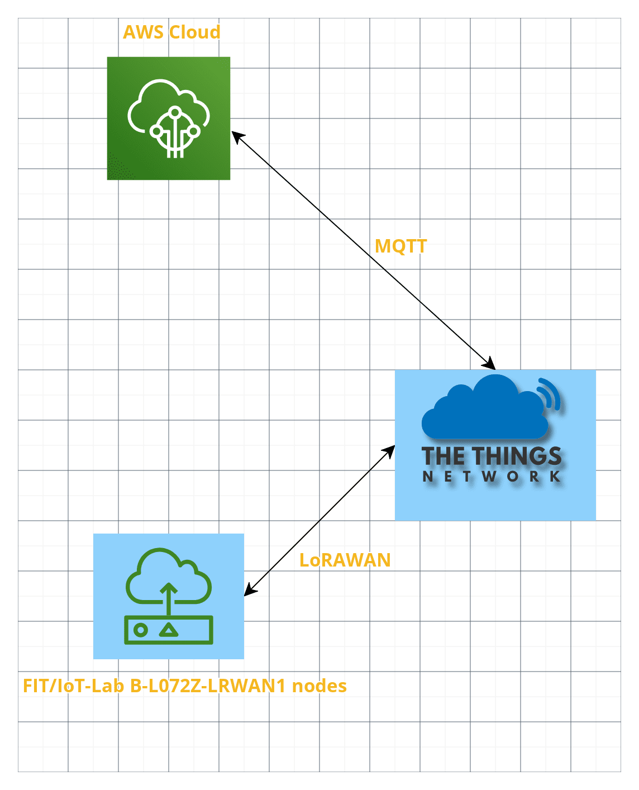
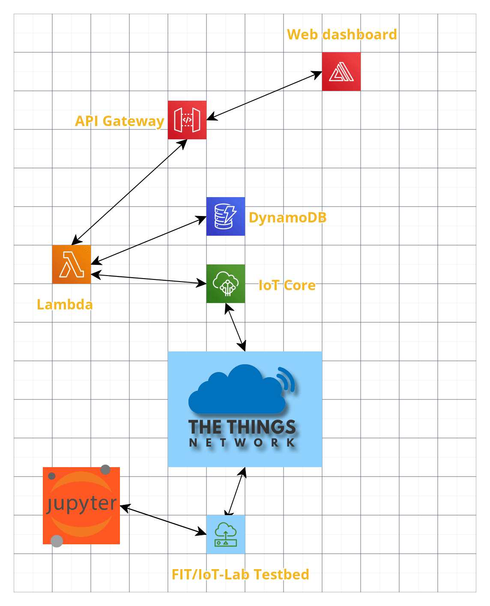
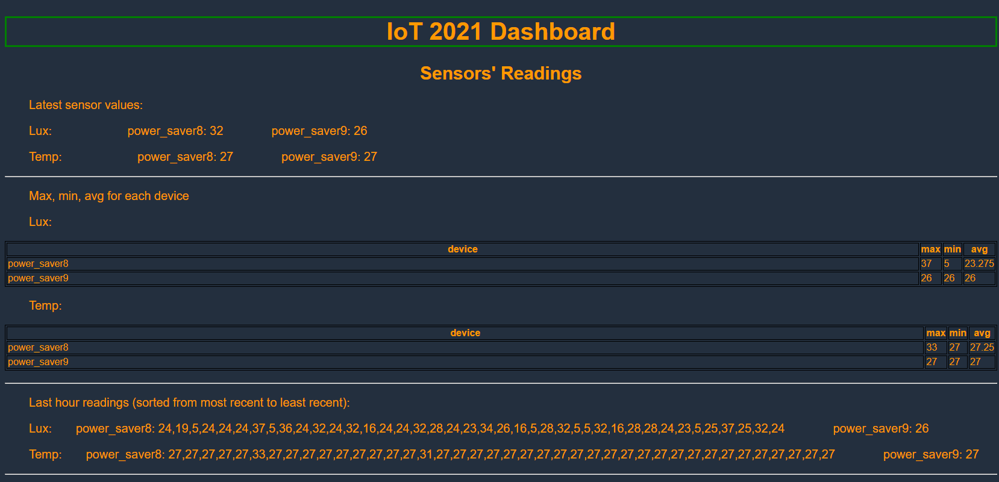
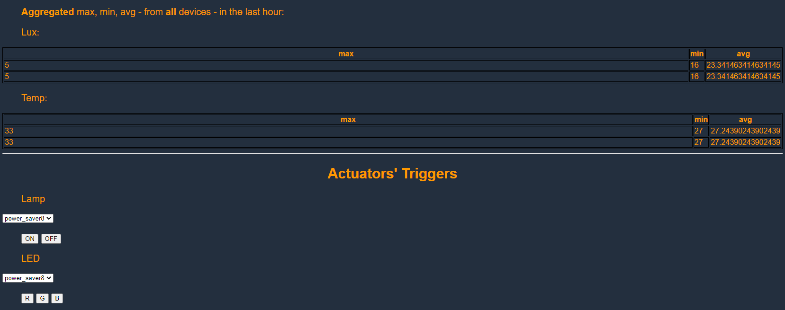

# IoT-2021-Individual-Assigments - Power Saver - #3
Individual assignments for the IoT 2021 Course @ Sapienza University of Rome

Web dashboard: https://dev867.dyaycgfnuds5z.amplifyapp.com/

## 0. Blog post and Demo
* [**Blog post**](https://1701568-iot.blogspot.com/2021/06/3rd-assignment-blog-post.html)
* [**Demo**](https://youtu.be/F5hHvJlyssI)

## 1. Questions
### 1.1 How is the long-range low-power wide are network going to affect the IoT platform?

As *power saver* nodes are supposed to be deployed 1 per room, a possible problem may be due to several messages travelling towards the gateway at the same time, this can be solved by starting the nodes at different times to avoid overlapping sendings.

Considering that this application is not time-critical, messages can allow some delays to be sent or received. Furthermore, the messages sent by the *power saver* nodes are small enough (in terms of bytes) to be sent without problems using the selected Spreading Factor (9 with a 1760 bit/s datarate and a 123-byte maximum payload size).

Nevertheless, considering the technical limitations of LoRaWAN, it makes sense to try to reduce the quanity and the frequency of the data sent to the cloud, in order to improve the energetic efficiency. For this reason, **the checks on the light and temperature thresholds were moved within the devices**. In this way, messages are sent from the nodes to the cloud **only** when an anomalous situation occurs (i.e., one of the sensed values exceeds one of the thresholds), instead on during normal situations (which are verified most of the time), the nodes do not send anything to the cloud. 
Since in the two previous assignments those checks were performed on the cloud, thus allowing to change the thresholds at once for all the devices, now the cloud infrastructure sends directly to the nodes the values that are needed to update those thresholds on the devices themselves.

### 1.2 What are the connected components, the protocols to connect them and the overall IoT architecture?
* **Network diagram**

* **Software components** - The only major difference in the cloud with respect to the other assignments is that now the lambda function that handles the uplink input is the one that is tasked with inserting the values inside the DynamoDB table.
Differently from the second assignment instead, now **The Things Network** is an intermediate node between the AWS IoT Core and the devices in the testbed. The nodes in IoT-lab are the [ST B-L072Z-LRWAN1](https://www.iot-lab.info/docs/boards/st-b-l072z-lrwan1/) ones.
* **Architecture diagram** 

The FIT/IoT-Lab Testbed node in the diagram includes the [ST B-L072Z-LRWAN1](https://www.iot-lab.info/docs/boards/st-b-l072z-lrwan1/) ndoes.

### 1.3 Performance Evaluation
It was not possible to evaluate the performance of the nodes, as [ST B-L072Z-LRWAN1](https://www.iot-lab.info/docs/boards/st-b-l072z-lrwan1/) nodes do not offer the possibility to measure their consumptions (after running an experiment with 3 nodes and a consumption monitoring profile attached to each of them, the result of the monitoring was an **empty folder**, as in `./performance/perf_3.zip`).
<!-- The performance of the system was measured using the consumption monitoring tools offered by the FIT/IoT-Lab facility.

3 [ST B-L072Z-LRWAN1](https://www.iot-lab.info/docs/boards/st-b-l072z-lrwan1/) nodes were used during the tests:

For the sake of time, the test's duration was set to 19 minutes, with a 5 minute interval between the sensing phases.

* power_saver6 and power_saver5 ran the usual firmware.
* power_saver3 ran a modified version of the firmware where the device does not perform the "edge check" mentioned above, thus sending a message every time it sensed the environment, therefore its power consumption should be higher than the two other nodes.

**Consumptions**
power_saver6

power_saver5

power_saver3 -->

## 2. Hands-on Walkthrough
### IoT-Lab Setup
In order to set up the FIT/IoT-Lab enviroment, it is enough to follow the Jupyter notebook provided in the _iot-lab_ folder, which explains every step to perform in order to reproduce the experiment.
### TTN Setup
Create an application on **The Things Network** as well as a number of end devices with the following characteristics:
* LoRaWAN Version = MAC V1.0.2
* Regional Parameters Version = PHY V1.0.2 REV B
* Frequency plan = Europe 863-870MHz (SF9 for RX2)
* Activation mode = OTAA

Then follow the [documentation to integrate TTN and AWS IoT](https://www.thethingsindustries.com/docs/integrations/aws-iot/default/), as well as that for [handling messages](https://www.thethingsindustries.com/docs/integrations/aws-iot/default/messages/).
### AWS setup
0) Create an application on *AWS IoT Core*.
1) Set up the *IoT core* rule as in `./iot_core/rules.sql`. Two actions should be linked to the rule: 
    1. sending a message to a lambda function (`./iot_core/lambda.py`).
2) Add the other lambdas that can be found in the `./iot_core` folder to aws lambda and set up an *AWS API Gateway* for each one of them.
3) Create a website on *AWS Amplify* using the code for the web dashboard in `./web_dashboard/index.html`

*Note: some of the steps above may require creating and correctly configuring roles and policies in the *IAM Console* in order for everything to work as intended.*

## Extra: Web Dashboard Example

