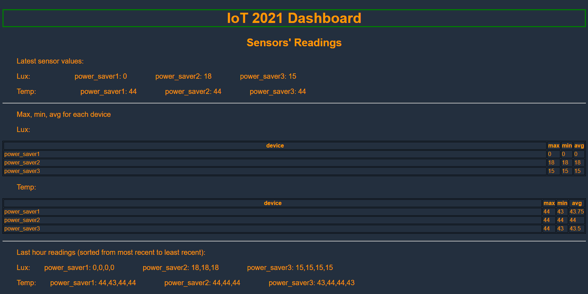
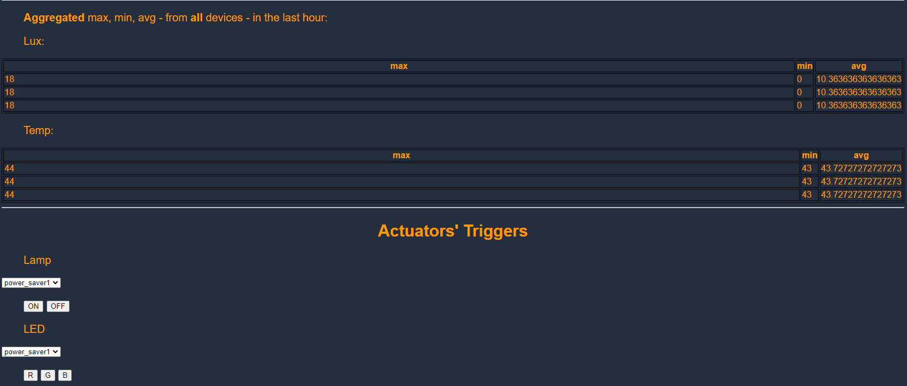

# IoT-2021-Individual-Assigments - Power Saver - #3
Individual assignments for the IoT 2021 Course @ Sapienza University of Rome

Web dashboard: https://dev867.dyaycgfnuds5z.amplifyapp.com/

## 1. Questions

## 2. Hands-on Walkthrough
### IoT-Lab Setup
In order to set up the FIT/IoT-Lab enviroment, it is enough to follow the Jupyter notebook provided in the _iot-lab_ folder, which explains every step to perform in order to reproduce the experiment, flash the firmwares and run the MQTT/SN broker plus the transparent bridge. 
### Remote setup
0) Create an application on *AWS IoT Core* & download the certificates and private keys from the IoT core to be used by the `mosquitto` instance on your local machine.
1) Set up the *IoT core* rule as in `./iot_core/rules.sql`. Two actions should be linked to the rule: 
    1. putting the data in a *DynamoDB* table (using `${timestamp()}` as primary key and `${id}` as sort key) in the `device_data` column; 
    2. sending a message to a lambda function (`./lambda.py`).
2) Add the other lambdas that can be found in the `./iot_core` folder to aws lambda and set up an *AWS API Gateway* for each one of them.
3) Create a website on *AWS Amplify* using the code for the web dashboard in `./web_dashboard/index.html`

*Note: some of the steps above may require creating and correctly configuring roles and policies in the *IAM Console* in order for everything to work as intended.*

## Extra: Web Dashboard Example

