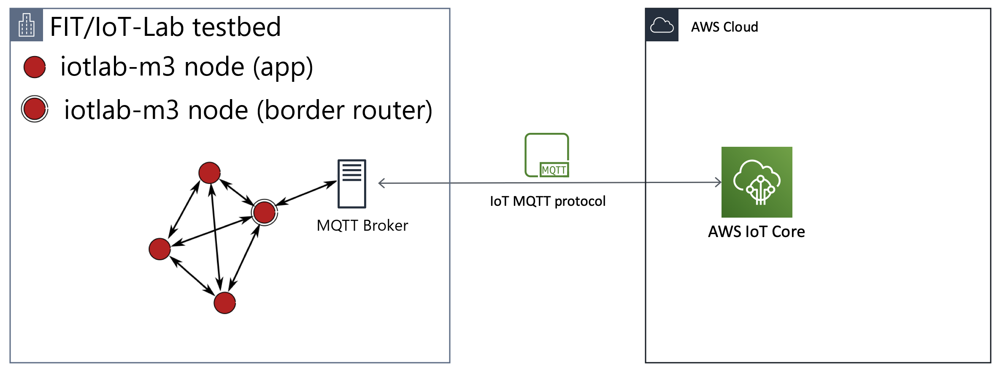
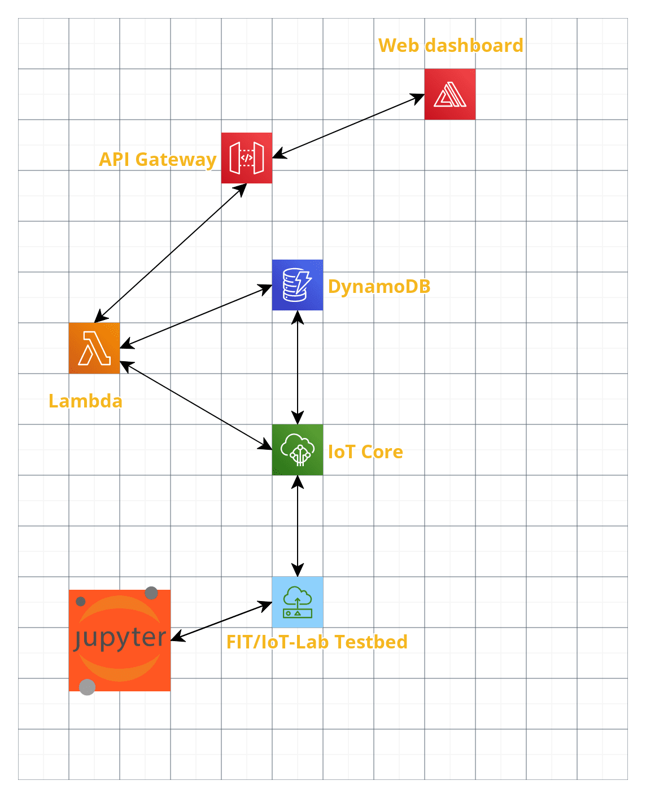

# IoT-2021-Individual-Assigments - Power Saver - #2
Individual assignments for the IoT 2021 Course @ Sapienza University of Rome

Web dashboard: https://dev867.dyaycgfnuds5z.amplifyapp.com/

## 1. Questions
### 1.1. How is the deployment of multiple sensors going to affect the IoT platform?
For this kind of application, it is enough to deploy 1 single device per room, as the light intensity and temperature measures will hardly differ in the case multiple devices are placed in the same ambient, if the device is placed in a central position in the room.  
The benefit of deploying multiple sensors in this case may help in terms of the analysis of the data sensed in multiple rooms to adjust the thresholds that lead the cloud system to trigger the actuators and possibly find common ones for all the rooms on the same floor inside a building.

The main limitation of a multi-hop wireless network in this case is that it will take a while to send the data to the cloud and receive a response, which may also get lost while travelling, thus leading to power wastes until the next iteration of the sensing. 

### What are the connected components, the protocols to connect them and the overall IoT architecture?
* **Network diagram**

The system used for the experiment uses 2 kinds of nodes from the testbed:
* 2+ [IoT-Lab M3](https://www.iot-lab.info/docs/boards/iot-lab-m3/) nodes, one of which acts as border router of the mesh while the remaining ones run the application developed for the 1st assignment, adequately modified to use the new communication technology and the sensors from the m3 nodes instead of the STM32 nucleo board.
* 1 [IoT-LAB A8-M3](https://www.iot-lab.info/docs/boards/iot-lab-a8-m3/) node, which hosts both the MQTT/SN broker and the MQTT transparent bridge towards the AWS cloud infrastructure.

* **Software components** -
The cloud components remain unchanged with respect to the first assignment, except for a few adjustments to the code of the lambdas to handle multiple devices. Two additional software components have been employed for this assignment, both at the testbed level:
    - The [generic border router provided by RIOT](https://github.com/RIOT-OS/RIOT/tree/master/examples/gnrc_border_router) in order to allow the m3 nodes to communicate with the a8 node, which bridges the communication to the clound infrastructure via MQTT.
    - A *Jupyter* notebook is employed to interact with the real-world testbed in order to submit and run the experiments. 
* **Architecture diagram**

The _FIT/IoT-Lab Testbed_ node in the diagram includes the m3 nodes running the application, the m3 node running the generic border router firmware and the a8 node running the MQTT broker plus the transparent bridge.

## 2. Hands-on Walkthrough
### IoT-Lab Setup
In order to set up the FIT/IoT-Lab enviroment, it is enough to follow the Jupyter notebook provided in the _iot-lab_ folder, which explains every step to perform in order to reproduce the experiment, flash the firmwares and run the MQTT/SN broker plus the transparent bridge. 
### Remote setup
0) Create an application on *AWS IoT Core* & download the certificates and private keys from the IoT core to be used by the `mosquitto` instance on your local machine.
1) Set up the *IoT core* rule as in `./iot_core/rules.sql`. Two actions should be linked to the rule: 
    1. putting the data in a *DynamoDB* table (using `${timestamp()}` as primary key and `${id}` as sort key) in the `device_data` column; 
    2. sending a message to a lambda function (`./lambda.py`).
2) Add the other lambdas that can be found in the `./iot_core` folder to aws lambda and set up an *AWS API Gateway* for each one of them.
3) Create a website on *AWS Amplify* using the code for the web dashboard in `./web_dashboard/index.html`

*Note: some of the steps above may require creating and correctly configuring roles and policies in the *IAM Console* in order for everything to work as intended.*

## Extra: Web Dashboard Example

